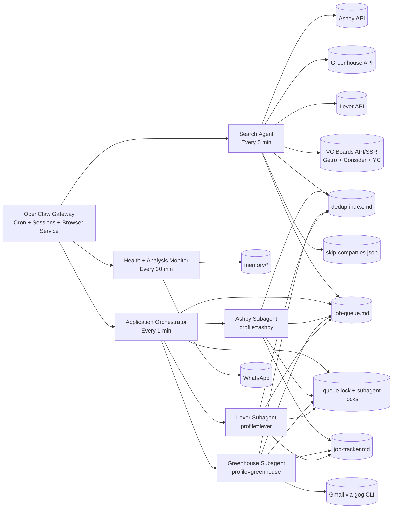

# JobHunt — Autonomous AI Job Search Agent

JobHunt is an OpenClaw-powered autonomous system for continuous job discovery and application.  
It runs a producer/consumer pipeline with ATS-partitioned browser workers, queue safety locks, and orchestration that can operate continuously in the background.

Built on [OpenClaw](https://github.com/nichochar/openclaw), powered by Claude Sonnet 4.6.

## Current Runtime (Feb 2026)

| Component | Schedule | Role |
|---|---|---|
| `Search Agent` | `*/5 * * * *` | API-first discovery across Ashby/Greenhouse/Lever + VC boards + Brave fallback; score + dedup + enqueue |
| `Application Orchestrator` | `*/1 * * * *` | Deterministic dispatch snapshot + adaptive preflight + parallel ATS subagent fan-out |
| `Health + Analysis Monitor` | `*/30 * * * *` | Unified health checks, scheduler updates, and analysis digests |

Notes:
- The old monolithic `Application Agent` has been replaced by `Application Orchestrator`.
- `Email Monitor` cron job has been removed.
- Greenhouse verification codes are fetched on-demand via `gog gmail search` in the Greenhouse application flow.

---

## Architecture Overview


Static PNG rendering of the architecture for docs/readability. Mermaid source is kept below for editable diagrams.



---

## Detailed Search Pipeline Flowchart

```mermaid
flowchart TD
    A[Search Agent Tick\nEvery 5 min] --> B[Load Hot Memory\nread-memory.py hot]
    B --> C[Read Rotation + Watchlist]
    C --> D[API Discovery Pass]

    D --> D1[Ashby API search\nsearch-ashby-api.py --all --add]
    D --> D2[Greenhouse API search\nsearch-greenhouse-api.py <slug> --add]
    D --> D3[Lever API search\nsearch-lever-api.py --all --add]
    D --> D4[Brave Search API\n(query fallback)]

    D1 --> E[Normalize Listings]
    D2 --> E
    D3 --> E
    D4 --> E

    E --> F[Hard Filters\nUS-only, salary floor, title fit]
    F --> G[Dedup Check\ncheck-dedup.py]
    G -->|DUPLICATE| G1[Skip + keep index]
    G -->|NEW| H[Score Job\nRecency+Salary+Company+Match]

    H --> I[Skip List Gate\nskip-companies.json]
    I -->|blocked| I1[Drop + log reason]
    I -->|allowed| J[Add to Queue\nadd-to-queue.py]

    J --> K[Sorted Pending Queue\njob-queue.md]
    K --> L[Yield Logging + Scheduler Inputs\nlog-yield.py / dynamic-scheduler.py]

    M[Optional Browser Pass\nLinkedIn/YC/custom boards] --> E
```

### Search guarantees
- API-first path minimizes browser overhead and token usage.
- Queue insertion is score-ordered so highest-value opportunities surface first.
- Dedup + skip-list checks happen before enqueue to avoid queue pollution.

---

## Detailed Application Pipeline Flowchart

```mermaid
flowchart TD
    A[Application Orchestrator Tick\nEvery 1 min] --> B[Batch Preflight\nbatch-preflight.py --all --remove --top 30 --timeout 90]
    A --> D0[Dispatch Snapshot\norchestrator-dispatch.py --json]
    D0 --> B
    B --> C[For ATS in {ashby, greenhouse, lever}]

    C --> D[Check lock\nsubagent-lock.py check <ats>]
    D -->|LOCKED| D1[Skip ATS this cycle]
    D -->|UNLOCKED| E[Check actionable queue\nqueue-summary.py --actionable --ats <ats> --top 1]
    E -->|empty| E1[Skip ATS this cycle]
    E -->|has work| F[Mark ATS READY]

    F --> G[Fan-out spawn via sessions_spawn\nall READY ATS in same orchestrator run]

    G --> ASH[Ashby Subagent]
    G --> GH[Greenhouse Subagent]
    G --> LEV[Lever Subagent]

    subgraph WorkerLifecycle[Per-ATS Subagent Lifecycle]
      W1[Acquire ATS lock\nsubagent-lock.py lock <ats>] --> W2[Read ATS SKILL.md]
      W2 --> W3[Pull top actionable ATS job]
      W3 --> W4[URL preflight-check.py]
      W4 -->|dead| W4a[remove-from-queue.py]
      W4 -->|alive| W5[Navigate in dedicated browser profile]
      W5 --> W6[Run ATS form-filler.js]
      W6 --> W7[Handle ATS-specific controls\ncombobox/toggle/ref refresh/upload verify]
      W7 --> W8[Handle custom Qs / essays]
      W8 --> W9[Submit]
      W9 --> W10[Post-submit verify]
      W10 -->|success| W11[mark-applied.py + tracker append]
      W10 -->|CAPTCHA or repeated failure| W12[Keep pending for retry/defer]
      W11 --> W13[Next job (up to per-run cap)]
      W12 --> W13
      W13 --> W14[Unlock ATS lock\nsubagent-lock.py unlock <ats>]
    end

    GH --> V1[Greenhouse email verification path]
    V1 --> V2[gog gmail search from:greenhouse subject:security code]
    V2 --> V3[Fill 8-char code via greenhouse-verify-code.js]

    LEV --> L1[hCaptcha path]
    L1 --> L2[Try bounded rounds]
    L2 -->|still blocked| L3[Defer in queue + continue]

    HM[Health + Analysis Monitor] --> HX[Detect lock starvation / stuck runs / errors]
    HX --> WA[WhatsApp alerts]
```

### Application guarantees
- ATS partitioning prevents cross-worker collisions.
- Locking prevents duplicate subagents for the same ATS.
- Shared `.queue.lock` plus atomic scripts prevent queue corruption.
- CAPTCHA-blocked jobs are deferred (not dropped), so they can retry in later cycles.

---

## Reliability and Concurrency Controls

| Risk | Current Mitigation |
|---|---|
| Duplicate subagent spawn | `subagent-lock.py` per ATS (`ashby`, `greenhouse`, `lever`) |
| Zombie lock file | Stale lock expiration + PID liveness validation |
| Queue read/write races | Shared `.queue.lock` (`LOCK_SH` for reads, `LOCK_EX` for writes) |
| Dead links blocking queue head | `batch-preflight.py --remove` + per-job preflight checks |
| CAPTCHA loops preventing drain | Bounded retries + defer/keep-pending policy in ATS skills |
| Cron lane serialization | `sessions_spawn` fan-out to subagent lane |
| Silent orchestrator drift | Per-cycle guardrail logs (`logs/orchestrator-cycles.jsonl`) + freshness checks |
| Parser divergence across scripts | Shared queue parser module (`scripts/queue_utils.py`) |

---

## Gmail Integration (Important)

- **Greenhouse verification is on-demand**: subagent calls `gog gmail search` when a code is required.
- **Gmail watcher is optional for this step**: watcher is only required for real-time inbound email events/hooks.
- If you want live email-triggered automation, keep one clean watcher instance.

---

## Supported ATS Status

| ATS | Search | Apply | Notes |
|---|---|---|---|
| Ashby | API | Automated | Toggle-heavy forms handled by ATS skill |
| Greenhouse | API | Automated | Email verification code handled via `gog gmail search` |
| Lever | API | Automated with retry/defer | hCaptcha can still block individual jobs; blocked jobs stay pending for future retry |

---

## Dashboard Notes

- **Applied search box** now supports normal typing while filtering (focus/cursor preserved during live re-render).
- **Stage update from Applied tab** now supports dedup-only entries by backfilling tracker rows when needed.
- **Interviews count** is calculated from tracker stages: `Phone Screen + Technical Interview + Take Home + Onsite/Final`.

---

## Quick Start

### 1) Install OpenClaw
```bash
git clone https://github.com/nichochar/openclaw.git ~/openclaw
cd ~/openclaw && pnpm install
```

### 2) Clone JobHunt
```bash
git clone https://github.com/agi-2026/jobhunt.git ~/jobhunt
cd ~/jobhunt
```

### 3) Setup
```bash
./setup.sh
```

### 4) Configure profile and credentials
- `workspace/SOUL.md`
- `workspace/form-fields.md`
- `workspace/AGENTS.md`
- `cron/jobs.json`
- `.env`

### 5) Launch
```bash
cd ~/openclaw && pnpm openclaw channels login --channel whatsapp --account default
cd ~/jobhunt && ./start.sh
```

---

## Operational Commands

### Restart gateway (reload cron/jobs changes)
```bash
kill $(pgrep -f openclaw-gateway) && cd ~/openclaw && pnpm openclaw gateway --port 18789
```

### Sync canonical cron config to runtime
```bash
python3 workspace/scripts/sync-cron-config.py
```

### Clean single watcher restart
```bash
openclaw gateway stop
pkill -f "gog gmail watch serve" || true
cd ~/openclaw && pnpm openclaw gateway --port 18789
```

### Disable watcher (if not needed)
```bash
OPENCLAW_SKIP_GMAIL_WATCHER=1 pnpm openclaw gateway --port 18789
```

---

## Troubleshooting

### Gateway says port already in use
An existing gateway instance is already running. Stop it first:
```bash
openclaw gateway stop
```

### Gmail watcher bind error on `8788`
Another watcher process owns the port. Kill stale watcher process, then restart gateway.

### Subagent lock appears stuck
Check and clear lock:
```bash
python3 workspace/scripts/subagent-lock.py check ashby
python3 workspace/scripts/subagent-lock.py unlock ashby
```

### Queue not draining
Verify:
1. Orchestrator is enabled and running every minute.
2. `queue-summary.py --actionable --ats <ats>` has jobs.
3. No ATS lock is perpetually stuck.
4. `batch-preflight.py` is removing dead links.

### Verify orchestration guardrail freshness
```bash
python3 workspace/scripts/log-orchestrator-cycle.py --check-fresh --max-age-min 10
```

---

## License

MIT License. See `LICENSE`.

---

Built by [@agi-2026](https://github.com/agi-2026) while racing an H-1B deadline.
