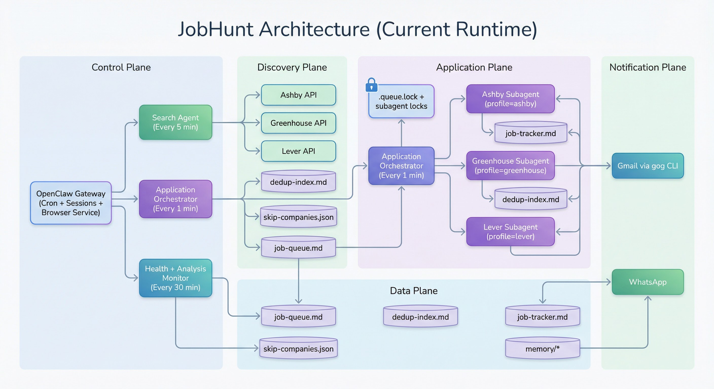

# JobHunt — Autonomous AI Job Search Agent

JobHunt is an OpenClaw-powered autonomous system for continuous job discovery and application.  
It runs a producer/consumer pipeline with ATS-partitioned browser workers, queue safety locks, and orchestration that can operate continuously in the background.

Built on [OpenClaw](https://github.com/nichochar/openclaw), with model routing configurable per agent.

## Current Runtime (Feb 2026)

| Component | Schedule | Role |
|---|---|---|
| `Search Agent` | `0 */2 * * *` | API-first discovery across Ashby/Greenhouse/Lever + VC boards + Brave fallback; score + dedup + enqueue |
| `Application Orchestrator` | `*/5 * * * *` | Deterministic dispatch snapshot + adaptive preflight + true global-top ATS pick + single subagent spawn |
| `Health + Analysis Monitor` | `*/30 * * * *` | Unified health checks, scheduler updates, and analysis digests |

Notes:
- The old monolithic `Application Agent` has been replaced by `Application Orchestrator`.
- `Email Monitor` cron job has been removed.
- Greenhouse verification codes are fetched on-demand via `gog gmail search` in the Greenhouse application flow.
- Current default model mix: orchestrator/subagents via OpenRouter (`moonshotai/kimi-k2.5:nitro`), search/health via Gemini Flash preview.

---

## Architecture Overview



Static PNG rendering of the architecture for docs/readability. Mermaid source is kept below for editable diagrams.

```mermaid
flowchart LR
    OC[OpenClaw Gateway\nCron + Sessions + Browser Service]
    SA[Search Agent\nEvery 2 hours]
    AO[Application Orchestrator\nEvery 5 min (single spawn)]
    HM[Health + Analysis Monitor\nEvery 30 min]

    Q[(job-queue.md)]
    D[(dedup-index.md)]
    T[(job-tracker.md)]
    L[(.queue.lock + subagent locks)]
    SKIP[(skip-companies.json)]
    MEM[(memory/*)]

    ASH[Ashby Subagent\nprofile=ashby]
    GH[Greenhouse Subagent\nprofile=greenhouse]
    LEV[Lever Subagent\nprofile=lever]

    ATSA[(Ashby API)]
    ATSG[(Greenhouse API)]
    ATSL[(Lever API)]
    VCB[(VC Boards API/SSR\nGetro + Consider + YC)]
    GMAIL[(Gmail via gog CLI)]
    WA[(WhatsApp)]

    OC --> SA
    OC --> AO
    OC --> HM
    SA --> ATSA
    SA --> ATSG
    SA --> ATSL
    SA --> VCB
    SA --> D
    SA --> SKIP
    SA --> Q

    AO --> L
    AO --> Q
    AO --> ASH
    AO --> GH
    AO --> LEV

    ASH --> L
    GH --> L
    LEV --> L

    ASH --> T
    GH --> T
    LEV --> T
    ASH --> D
    GH --> D
    LEV --> D
    ASH --> Q
    GH --> Q
    LEV --> Q

    GH --> GMAIL
    HM --> WA
    HM --> MEM
```

---

## Detailed Search Pipeline Flowchart

```mermaid
flowchart TD
    A[Search Agent Tick\nEvery 2 hours] --> B[Load Hot Memory\nread-memory.py hot]
    B --> C[Read Rotation + Watchlist]
    C --> D[API Discovery Pass]

    D --> D1[Ashby API search\nsearch-ashby-api.py --all --add]
    D --> D2[Greenhouse API search\nsearch-greenhouse-api.py --all --add]
    D --> D3[Lever API search\nsearch-lever-api.py --all --add]
    D --> D4[Brave Search API\n(query fallback)]

    D1 --> E[Normalize Listings]
    D2 --> E
    D3 --> E
    D4 --> E

    E --> F[Hard Filters\nUS-only, salary floor, title fit]
    F --> G[Dedup Check\ncheck-dedup.py]
    G -->|DUPLICATE| G1[Skip + keep index]
    G -->|NEW| H[Score Job\nRecency+Salary+Company+Match]

    H --> I[Skip List Gate\nskip-companies.json]
    I -->|blocked| I1[Drop + log reason]
    I -->|allowed| J[Add to Queue\nadd-to-queue.py]

    J --> K[Sorted Pending Queue\njob-queue.md]
    K --> L[Yield Logging + Scheduler Inputs\nlog-yield.py / dynamic-scheduler.py]

    M[Optional Browser Pass\nYC/custom boards only (no LinkedIn)] --> E
```

### Search guarantees
- API-first path minimizes browser overhead and token usage.
- Queue insertion is score-ordered so highest-value opportunities surface first.
- Dedup + skip-list checks happen before enqueue to avoid queue pollution.

---

## Detailed Application Pipeline Flowchart

```mermaid
flowchart TD
    A[Application Orchestrator Tick\nEvery 5 min] --> B[Batch Preflight\nbatch-preflight.py --all --remove --top 12 --timeout 90]
    B --> C[Check global apply lock\nsubagent-lock.py check apply]
    C -->|LOCKED| C1[Stop cycle]
    C -->|UNLOCKED| D[Dispatch Snapshot\norchestrator-dispatch.py --json]
    D --> E[Choose READY ATS with highest top_score\nTie: ashby > greenhouse > lever]
    E -->|none READY| E1[Stop cycle]
    E -->|chosen ATS| F[Spawn exactly ONE subagent\nsessions_spawn]

    F --> ASH[Ashby Subagent]
    F --> GH[Greenhouse Subagent]
    F --> LEV[Lever Subagent]

    subgraph WorkerLifecycle[Single Subagent Lifecycle]
      W1[Acquire global apply lock\nsubagent-lock.py lock apply] --> W2[Read ATS SKILL.md]
      W2 --> W3[queue-summary --actionable --ats <ats> --top 1]
      W3 --> W4[Bind immutable TARGET_URL + preflight]
      W4 -->|dead| W4a[remove-from-queue.py + STOP]
      W4 -->|alive| W5[Navigate with ATS profile]
      W5 --> W6[Run canonical ATS form-filler.js\nHandle combobox/toggle/upload/custom Qs]
      W6 --> W7[Submit + post-submit verification]
      W7 -->|success| W8[mark-applied.py + tracker append]
      W7 -->|blocked/ambiguous| W9[SKIPPED or DEFERRED]
      W8 --> W10[Unlock apply lock + STOP]
      W9 --> W10
    end

    GH --> V1[Greenhouse email verification path]
    V1 --> V2[gog gmail search from:greenhouse subject:security code]
    V2 --> V3[Fill 8-char code via greenhouse-verify-code.js]

    LEV --> L1[Lever policy check]
    L1 -->|disabled (default)| L2[Preflight + defer-manual-apply + STOP]
    L1 -->|enabled| L3[hCaptcha handling path]

    HM[Health + Analysis Monitor] --> HX[Detect lock starvation / stuck runs / errors]
    HX --> WA[WhatsApp alerts]
```

### Application guarantees
- Orchestrator spawns exactly one subagent per cycle based on true global-top score.
- Each subagent is single-job: one immutable `TARGET_URL`, one terminal outcome, then stop.
- Global apply lock and queue lock prevent concurrent double-apply and queue corruption.
- Canonical ATS form-filler paths are enforced to avoid ad-hoc filler drift.
- CAPTCHA/blocked jobs are skipped or deferred instead of being marked applied.

---

## Reliability and Concurrency Controls

| Risk | Current Mitigation |
|---|---|
| Duplicate subagent spawn | Global apply lock (`subagent-lock.py lock apply`) + deterministic single-spawn orchestrator policy |
| Zombie lock file | Stale lock expiration + PID liveness validation |
| Queue read/write races | Shared `.queue.lock` (`LOCK_SH` for reads, `LOCK_EX` for writes) |
| Dead links blocking queue head | `batch-preflight.py --remove` + per-job preflight checks |
| CAPTCHA loops preventing drain | Lever disabled-by-policy default + defer-manual path; ATS skills use bounded retries |
| Cron contention | Single subagent spawn per cycle + `sessions_spawn` isolation |
| Silent orchestrator drift | Guardrail logs (`logs/orchestrator-cycles.jsonl`, `logs/subagent-guardrails.jsonl`) + freshness checks |
| Parser divergence across scripts | Shared queue parser module (`scripts/queue_utils.py`) |

---

## Gmail Integration (Important)

- **Greenhouse verification is on-demand**: subagent calls `gog gmail search` when a code is required.
- **Gmail watcher is optional for this step**: watcher is only required for real-time inbound email events/hooks.
- If you want live email-triggered automation, keep one clean watcher instance.

---

## Supported ATS Status

| ATS | Search | Apply | Notes |
|---|---|---|---|
| Ashby | API | Automated | Toggle-heavy forms handled by ATS skill |
| Greenhouse | API | Automated | Email verification code handled via `gog gmail search` |
| Lever | API | Disabled by policy (default) | hCaptcha makes reliable automation low-confidence; flow defers manual apply unless explicitly re-enabled |

---

## Dashboard Notes

- **Applied search box** now supports normal typing while filtering (focus/cursor preserved during live re-render).
- **Stage update from Applied tab** now supports dedup-only entries by backfilling tracker rows when needed.
- **Interviews count** is calculated from tracker stages: `Phone Screen + Technical Interview + Take Home + Onsite/Final`.

---

## Quick Start

### 1) Install OpenClaw
```bash
git clone https://github.com/nichochar/openclaw.git ~/openclaw
cd ~/openclaw && pnpm install
```

### 2) Clone JobHunt
```bash
git clone https://github.com/agi-2026/jobhunt.git ~/jobhunt
cd ~/jobhunt
```

### 3) Setup
```bash
./setup.sh
```

### 4) Configure profile and credentials
- `workspace/SOUL.md`
- `workspace/form-fields.md`
- `workspace/AGENTS.md`
- `cron/jobs.json`
- `.env`

### 5) Launch
```bash
cd ~/openclaw && pnpm openclaw channels login --channel whatsapp --account default
cd ~/jobhunt && ./start.sh
```

---

## Operational Commands

### Restart gateway (reload cron/jobs changes)
```bash
kill $(pgrep -f openclaw-gateway) && cd ~/openclaw && pnpm openclaw gateway --port 18789
```

### Sync canonical cron config to runtime
```bash
python3 workspace/scripts/sync-cron-config.py
```

### Clean single watcher restart
```bash
openclaw gateway stop
pkill -f "gog gmail watch serve" || true
cd ~/openclaw && pnpm openclaw gateway --port 18789
```

### Disable watcher (if not needed)
```bash
OPENCLAW_SKIP_GMAIL_WATCHER=1 pnpm openclaw gateway --port 18789
```

---

## Troubleshooting

### Gateway says port already in use
An existing gateway instance is already running. Stop it first:
```bash
openclaw gateway stop
```

### Gmail watcher bind error on `8788`
Another watcher process owns the port. Kill stale watcher process, then restart gateway.

### Subagent lock appears stuck
Check and clear lock:
```bash
python3 workspace/scripts/subagent-lock.py check ashby
python3 workspace/scripts/subagent-lock.py unlock ashby
```

### Queue not draining
Verify:
1. Orchestrator is enabled and running every 5 minutes.
2. `queue-summary.py --actionable --ats <ats>` has jobs.
3. Global apply lock is not perpetually stuck: `python3 workspace/scripts/subagent-lock.py check apply`.
4. `batch-preflight.py` is removing dead links.

### Verify orchestration guardrail freshness
```bash
python3 workspace/scripts/log-orchestrator-cycle.py --check-fresh --max-age-min 10
```

---

## License

MIT License. See `LICENSE`.

---

Built by [@agi-2026](https://github.com/agi-2026) while racing an H-1B deadline.
